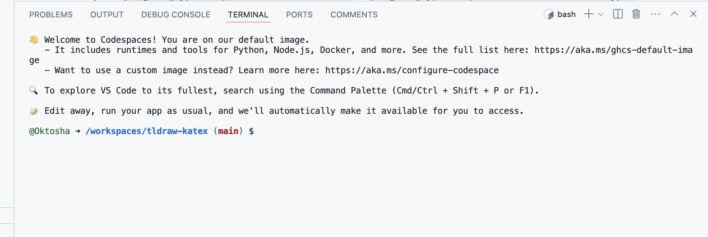

# Tldraw + KaTeX prototype

This repo contains a prototype of how [KaTeX](https://katex.org) integration could look like in [tldraw](https://tldraw.dev).


The prototype is very rough, see issues for the known caveats.

# Running

I suggest 2 options:

1. Run locally
2. Run in a github codespace (it's free!) where everything is installed for you on the github remote machine and you can interact with the code right from your browser

## Option 1: running locally

You need [node.js](https://nodejs.org/en/) javascript engine to run `npm` command in your terminal (npm stands for "node package manager"). If you don't have [node.js](https://nodejs.org/en/) I reccomend to install it with `nvm` — [node version manager](https://github.com/nvm-sh/nvm).

Once you have node installed, run the following from the root of this repo.

```shell
npm install
npm run dev
```

This will start a local development server. The output in the terminal will look something like this:

```

  VITE v5.3.1  ready in 113 ms

  ➜  Local:   http://localhost:5173/
  ➜  Network: use --host to expose
  ➜  press h + enter to show help
```

So you can open the address `http://localhost:5173/` in your browser to see the running example.

## Option 2: running in a codespace

First you need a codespace. Click "code -> codespaces -> plus sign"


Github will create a codespace for you and suggest to open it in VSCode — popular IDE. If you don't have it — no problem, just click cancel.


Now return back to the repo page and click code again. You'll see a codespace created for you. The name is random, in my case it's **verbose space invention** You can open it in browser.


Github opens a web version of vscode for you. Find the terminal area. It will greet you.



Type the following commands into the terminal (same as locally).

```shell
npm install
npm run dev
```

*Looks like github runs `npm install` for you but there is no harm in running it again*

When your dev server is up, a popup will appear. Click the big green button to see the code working!


The quotas for github codespaces are quite generous but it's still easy to eat it all up by mistake. Active codespaces eat compute quota and storage quota. Switched off codespaces eat storage quota. You can see all your codespaces at [http://github.com/codespaces](http://github.com/codespaces).


# License note

The code in this repo is MIT licensed. I will be glad if you use it.

But the original tldraw code has it's own license. That license doesn't allow commercial use without the permission of tldraw creators. Contact them!